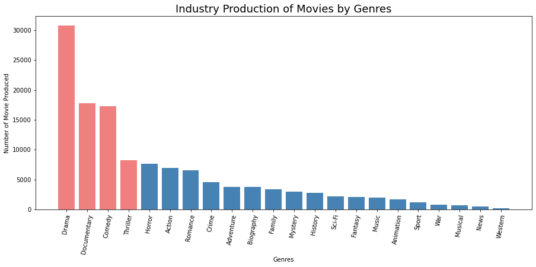
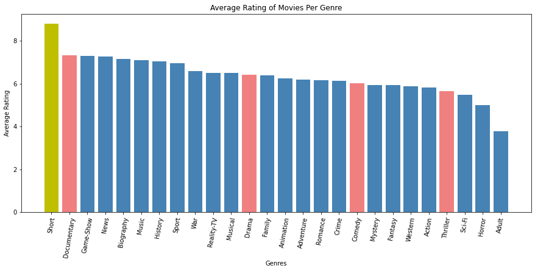
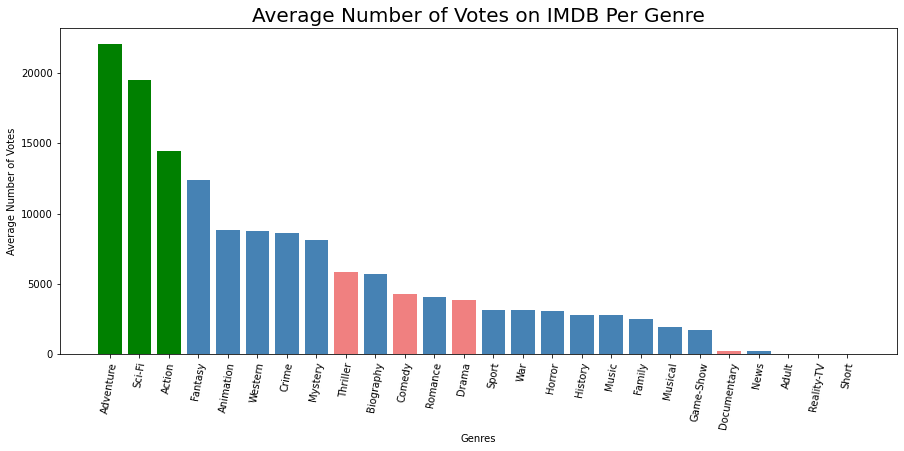
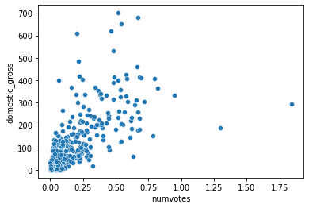
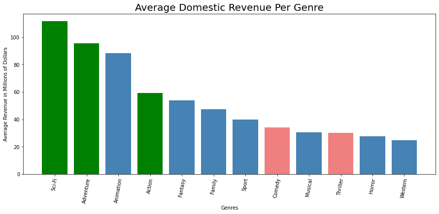
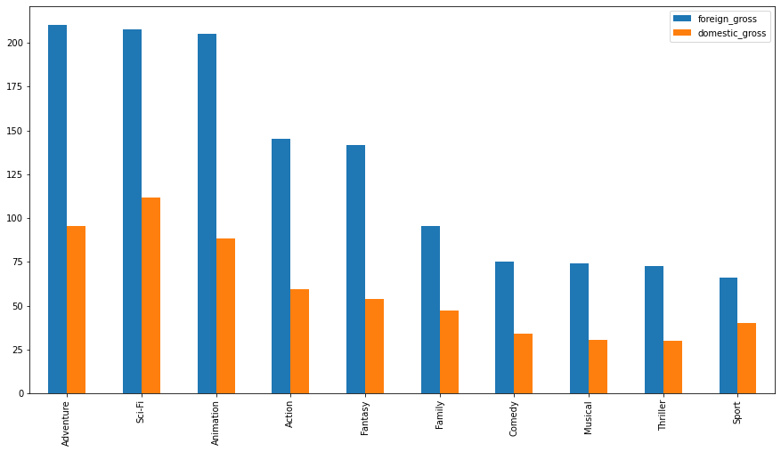

# Analysing Film Data for Insights

    **Authors**: Harmandip Singh

## Overview

This project analzyes possible avenues that would help make a possible Microsoft Film Studio Successful. Analysis of the data yiedled key insights into competitors and possible avenues for Microsoft to pursue. The data showed that the the genres most often produced by studios consisted of Drama, Comedy, and Thrillers. Hoever these genres showed no relationship in producing high ratings or higher revenues. Therefore we suggest Microsoft to not produce these wasted genres. INstead Microsoft should produce Shorts and Documentaries to try and get high ratings while capturing the attention of critics to build brand recognition. In addition they should focus on making Adventure, Action, and Sci-Fi movies that help bring in large amounts of revenue in foreign and domestic markets. 

## Business Problem

We are trying to provide the best solution for a possible Microsoft film studio to become successful. I belieeve it is important to capture revenue share and produce high rated content to build brand recognition. We plan to see if the data can offer insights on how we could do this.


## Data

The data in was collected from IMDB long running dataset of films and shows. The dataset contains more than 140,000 data points. The files provide information on titles, genres, runtime, ratings, and number of votes. The second data set was pulled from BoxOFfice Mojo site and contaianed information about domestic of foreign revenue for movie titles.


## Methods

This project uses descriptive analysis using bar plots and average to compare stats across categories. Scatterplots weere used to asses a rough estimate of a relationship between two data points and later confirmed using box plots. All of our anlysis revolved around Genre groups as we believe there is enough diversity between them and they have different replations with ratings and revenue. 


## Results

Drama, Documentary, Comedy, and Thrillers are some of the most porduced genres of films in the industry. 




From the top produced Genres only Documentaries averages a high ranking on IMDB while Drama, Codedy, and Thrillers are middle of the pack. 
Shorts are by far the highest rated genre on average



The highest voted and popular genres are Adventure, Action, and Sci-Fi. Again heavily produced genres such as Drama do not garner more attention.



There seems to be a positive relationship between number of votes and Domestic Revenue



This popularity in votes transfers over to domestic revenue where Adventure, Action , and Sci-Fi genres on avaerage return some of the highest revenues. 




This relationship carries over to foreign markets and Adventure, action, and Sci-Fi genres are in the top 4 in producing foreing revenues. 




## Conclusions

1) Microsoft should stay away from mass produced genre such as Drama, Comedy, and Thriller because they do not provide reurn on ratings or revenue

2) Create Shorts and Documentaries to capture high ratings and praise from critics building brand image

3) Create Adventure, Action, and Sci-Fi films because they tend to attract the most attention and provide greater domestic and foreing revenue compared to other genres. 

4) Future Analyss can be conducted into not only revenues but profit margins and see if any hidden gem genres emerge. 

## For More Information

Please review our full analysis in [our Jupyter Notebook](./Microsoft Analysis Notebook.ipynb) or our [presentation](./Microsoft Studios.pdf).

For any additional questions, please contact **name:Harmandip Singh, email:harmandip6@gmail.com

## Repository Structure

Describe the structure of your repository and its contents, for example:

```
├── README.md                           <- The top-level README for reviewers of this project
├── dsc-phase1-project-template.ipynb   <- Narrative documentation of analysis in Jupyter notebook
├── DS_Project_Presentation.pdf         <- PDF version of project presentation
├── data                                <- folder: A folder for the data you reference with your code
└── images                              <- Sourced externally and provided in a file
```
